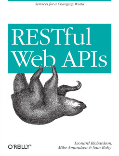
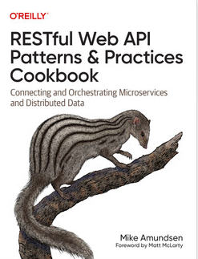

# Développement API (web API/RESTful API)

- [Développement API (web API/RESTful API)](#développement-api-web-apirestful-api)
  - [Démos](#démos)
    - [Démo *youtypeitwepostit*](#démo-youtypeitwepostit)
    - [Démo du cours](#démo-du-cours)
  - [Exercices et corrections](#exercices-et-corrections)
    - [Énoncés](#énoncés)
    - [Suggestions de correction](#suggestions-de-correction)
  - [Kit de démarrage complet pour développer son API](#kit-de-démarrage-complet-pour-développer-son-api)
  - [Outils](#outils)
    - [Clients HTTP](#clients-http)
  - [Références](#références)
  - [Ouvrages de référence](#ouvrages-de-référence)
  - [Conférences (YouTube)](#conférences-youtube)
  - [Articles sur REST et les services RESTful](#articles-sur-rest-et-les-services-restful)
  - [Articles sur REST et les services RESTful](#articles-sur-rest-et-les-services-restful-1)
  - [RFC (*Request For Comments*) intéressantes et utilisées](#rfc-request-for-comments-intéressantes-et-utilisées)
  - [Sur le cache HTTP](#sur-le-cache-http)
  - [Spécifications de représentations des ressources](#spécifications-de-représentations-des-ressources)
  - [Spécifications sur les modèles de données](#spécifications-sur-les-modèles-de-données)

## Démos

Liste des démos (mini projets pour présenter un ou plusieurs concepts)

### Démo *youtypeitwepostit*

Disponible sur [ce dépôt](https://github.com/RESTful-Web-APIs/example-code).

- [Télécharger le code source](https://github.com/RESTful-Web-APIs/example-code/tree/master/YouTypeIt)
- Lancer la démo : 

~~~bash
#A la racine du projet
node server/app.js
~~~

### Démo du cours

- [Accéder aux démos JS/Node.js/Express.js](./demos/)
- [Accéder à la démo architecture RPC vs ROA](./demos/demo-roa-vs-rpc/)
- [Démo JWT en *vanilla* PHP](https://github.com/paul-schuhm/demo-jwt)

## Exercices et corrections

### Énoncés

- [Liste d'exercices sur la conception de web API](./exercices/exercices-web-api.pdf)
- [Liste d'exercices sur JS/Node.js/Express.js](./exercices/exercices-js-node-express.pdf)

### Suggestions de correction

- [Suggestion conception d'API](./exercices/suggestions-exercices-web-api/)
- [Suggestion JS/Node.js/Express.js](./exercices/suggestions-exercices-js-node-express/)

## Kit de démarrage complet pour développer son API

- [Starter pack: RESTful web API avec Node.js, Express.js, MySQL et Adminer](https://github.com/paul-schuhm/starterpack-api-nodejs), un starter pack dockerisé d'une application web Node.js pour développer une web API RESTful. En plus d'un service Node.js pour développer son application/API, le pack vient avec un service de base de données relationnelles (MySQL) et un gestionnaire de base de données graphique (Adminer).

## Outils

### Clients HTTP

- [cURL](https://curl.se/), un outil en ligne de commande pour le transfert de données via des URL. Peut être utilisé comme un client HTTP. Attention, cURL sur Windows et cURL sur les systèmes UNIX (GNU/Linux et macOS) *ne sont pas implémentées pareil et ont des options différentes*. **Tous les exemples de cURL sur le dépôt et dans les supports de cours sont au format UNIX** (à adapter pour Windows si besoin), sinon [installer la WSL](https://learn.microsoft.com/fr-fr/windows/wsl/install) et utiliser `cURL` depuis votre instance GNU/Linux
- Sur Windows, [Invoke-RestMethod](https://learn.microsoft.com/en-us/powershell/module/microsoft.powershell.utility/invoke-restmethod?view=powershell-7.3), un client HTTP intégré à PowerShell. **Ouvrir une invite de commande PowerShell** pour l'utiliser
- [Extension VScode Thunder Client](https://www.thunderclient.com/), une extension pour effectuer des reqûetes HTTP et gérer des collections de requêtes depuis VS Code
- [Extension VSCode REST client](https://marketplace.visualstudio.com/items?itemName=humao.rest-client), une extension pour effectuer des reqûetes HTTP et gérer des collections de requêtes depuis VS Code, plus minimaliste mais efficace
- Postman, l'artillerie lourde. Nécessite de créer un compte
- [Swagger UI](https://swagger.io/tools/swagger-ui/), servir de la documentation et de quoi tester son API directement sur son service web (voir Exercice 2 et starter-pack)

## Références

## Ouvrages de référence

- [RESTful Web Services](https://learning.oreilly.com/library/view/restful-web-services/9780596529260/), de Leonard Richardson, Sam Ruby, O'Reilly, 2007 **S'il y a un livre à lire/étudier/feuilleter/avoir c'est celui-ci, must have**. Il commence à dater mais reste très profond et intéressant. Ce livre est passé sous licence Creative Commons dans le cadre du projet [O'Reilly Open Books](https://www.oreilly.com/openbook/). [Accéder à la version en ligne/PDF gratuite](http://restfulwebapis.org/rws.html) **LP++**
- [RESTful Web APIs](https://learning.oreilly.com/library/view/restful-web-apis/9781449359713/), de Leonard Richardson, Mike Amundsen, Sam Ruby, O'Reilly, 2013. Une version actualisée, rafraîchie de *RESTful Web Services*; **LE++**
- [REST API Design Rulebook](https://learning.oreilly.com/library/view/rest-api-design/9781449317904/), de Mark Masse, O'Reilly, 2011. **LI+** 
- [RESTful Web API Patterns and Practices Cookbook](https://www.oreilly.com/library/view/restful-web-api/9781098106737/), de Mike Amundsen, O'Reilly, 2022. Introduction un peu plus obscure, synthétique (mais intéressante !) que les livres de Richardson et al., se concentre sur les problèmes/solutions (comme son titre l'indique). *Très précieux pour mettre en application* ce que l'on a appris de Richardson, sur des cas concrets, complexes et réels. **LP+**;
- [REST API Development with Node.js : Manage and Understand the Full Capabilities of Successful REST Development, 2nd Edition](https://learning.oreilly.com/library/view/rest-api-development/9781484237151/), de Fernando Doglio, Apress, 2018
- [Bien architecturer une application REST](https://www.eyrolles.com/Informatique/Livre/bien-architecturer-une-application-rest-9782212850154/), par Olivier Gutknecht, avec la contribution de Jean Zundel, Eyrolles, 2009

## Conférences (YouTube)

- [Boostez vos applications avec HTTP/2 - Kévin Dunglas - Forum PHP 2018 ](https://www.youtube.com/watch?v=av9Z7NqMxFs&list=PLS3XEhTy6-Ale8Et6pxRR2I3LYNt8-rX3&index=16)
- [Performance Optimization - Fabien Potencier - PHP Tour 2016](https://www.youtube.com/watch?v=VuwyY_akLMA&list=PLS3XEhTy6-Ale8Et6pxRR2I3LYNt8-rX3&index=53)
- [Same-origin policy: The core of web security @ OWASP Wellington](https://www.youtube.com/watch?v=zul8TtVS-64&list=PLS3XEhTy6-Ale8Et6pxRR2I3LYNt8-rX3&index=19&t=2632s), excellente présentation de Kirk Jackson de la Same Origin Policy avec démonstrations à l'appui. **À regarder**.

## Articles sur le web, les systèmes hypertextes et les services RESTful

- [W3C: Cool URIs don't change](https://www.w3.org/Provider/Style/URI.html), par Tim Berners-Lee
- [W3C: Architecture of the World Wide Web, Volume One](https://www.w3.org/TR/2004/REC-webarch-20041215/), écrit par le *W3C Technical Architecture Group*: Tim Berners-Lee (co-Chair, W3C), Tim Bray (Antarctica Systems), Dan Connolly (W3C) et *al.*. Une *bible* sur l'architecture du web
- [REST](https://gayerie.dev/epsi-poe-201703/web-services/07_rest.html), une synthèse de David Gayerie sur REST de grande qualité, avec une bibliographie utile
- [How to get a cup of coffee (in REST)](https://www.infoq.com/articles/webber-rest-workflow/), une application démo utilisant l'architecture ROA
- [REST APIs must be hypertext-driven](https://roy.gbiv.com/untangled/2008/rest-apis-must-be-hypertext-driven), billet de blog de Roy T. Fiedling très intéressant sur le fait qu'une API RESTful doit être orientée *hypertexte* (ou de manière générale par les *hypermédia*)
- [Welcome to the REST CookBook](https://restcookbook.com/), portail sur différents aspects de REST
- [Zalando RESTful API and Event Guidelines](https://opensource.zalando.com/restful-api-guidelines/#)
- [The stateless blog](https://blog.stateless.co/), de [Mike Kelly](https://blog.stateless.co/about) :
  - [JSON Linking with HAL](https://blog.stateless.co/post/13296666138/json-linking-with-hal);
  - [The case for hyperlinks in APIs](https://blog.stateless.co/post/68259564511/the-case-for-hyperlinks-in-apis)
- [Services web](https://fr.wikipedia.org/wiki/Service_web), très bon article Wikipédia sur les services web et les différentes architectures

## RFC (*Request For Comments*) intéressantes et utilisées

> Documents à l'origine des standards du web

- [RFC3986: Uniform Resource Identifier (URI): Generic Syntax](https://www.rfc-editor.org/rfc/rfc3986.txt), T. Berners-Lee (W3C/MIT), R. Fielding (Day Software), L. Masinter (Adobe Systems)
- [JSON Hypertext Application Language draft-kelly-json-hal-08](https://datatracker.ietf.org/doc/html/draft-kelly-json-hal-08#section-8.1), HAL representation pour les modèles de données. Une proposition de standard
- [RFC 9068: JWT Profile for OAuth 2.0 Access Tokens](https://oauth.net/2/jwt-access-tokens/), la RFC du standard JWT

## Sur le cache HTTP

- [HTTP Caching](https://developer.mozilla.org/en-US/docs/Web/HTTP/Caching), une synthèse sur l'implémentation du cache du protocole HTTP. Attention, [tous les navigateurs n'implémentent pas le standard au même point](https://developer.mozilla.org/en-US/docs/Web/HTTP/Headers/Cache-Control#browser_compatibility).
- [Un tutoriel sur la mise en cache du protocole HTTP](https://www.mnot.net/cache_docs/), un très bon tutoriel en français sur la mise en cache du protocole HTTP

## Spécifications de représentations des ressources/messages

> Pas de standard ici, beaucoup de propositions de spécifications. Dans le cours nous utilisons HAL, mais il y'en a d'autres, plus utilisées

- [HAL Explorer](https://github.com/toedter/hal-explorer), with HAL Explorer you can browse and explore HAL and HAL-FORMS based RESTful Hypermedia APIs. HAL Explorer was inspired by Mike Kelly’s HAL-Browser. HAL Explorer also supports Spring Profiles.
- [API RESTful, spécification des schémas de données *HAL*](http://amundsen.com/hypermedia/), les différents types d'hypermédia définis pour le protocole HTTP et pour construire des API plus robustes. Le livre de l'auteur [Building Hypermedia APIs with HTML5 and Node](https://learning.oreilly.com/library/view/building-hypermedia-apis/9781449309497/), Amundsen, a l'air très intéressant
- [API RESTful, spécification des schémas de données *JSON-LD 1.1*, *A JSON-based Serialization for Linked Data*](https://www.w3.org/TR/json-ld/), une autre spécification des données renvoyées par une API, *soutenue et recommandée par le W3C*
- [OpenAPI Specification](https://spec.openapis.org/oas/latest.html), *The OpenAPI Specification (OAS)* defines a standard, programming language-agnostic interface description for HTTP APIs, which allows both humans and computers to discover and understand the capabilities of a service without requiring access to source code, additional documentation, or inspection of network traffic. **[Swagger](https://swagger.io/) est l'implémentation de cette spécification**
- [Hydra](http://www.markus-lanthaler.com/hydra/), Hydra is an effort to simplify the development of interoperable, hypermedia-driven Web APIs. The two fundamental building blocks of Hydra are *JSON‑LD* and the *Hydra Core Vocabulary*.

## Spécifications sur les modèles de données (vocabulaires)

- [Schema.org](https://schema.org/), *Schema.org is a collaborative, community activity with a mission to create, maintain, and promote schemas for structured data on the Internet*. Propose une liste de schémas à suivre pour différents modèles de données.
- [Microformats wiki](http://microformats.org/wiki/Main_Page), un wiki qui décrit des spécifications de structure de données interopérables 
