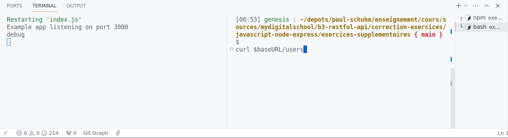

# Exercice supplémentaire sur Express.js et conseils

> N'utilisez *pas* le générateur d'Express pour cet exercice

## Préparation

1. Créer un dossier dédié pour l'exercice
2. Créer un fichier `README.md`
3. Dans le fichier `README.md`, ajouter un titre (h1), une courte description et 3 sections (h2) :
   1. **Lancer le projet** : instructions pour lancer le projet. Idéalement, on doit pouvoir copier/coller ces instructions sans réfléchir pour lancer votre projet
   2. **Requêtes HTTP** : la liste de vos requêtes HTTP que l'on pourra faire sur l'API. Pour pouvoir la tester sans inspecter le code dans un premier temps. C'est de la documentation
   3. **Références/Ressources/Liens utiles** : faites vous ici une liste de références et d'URLS qui vont ont aidé pour réaliser le projet (liens vers de la doc, module Node utilisés, article, guide, etc.)
4. Initialiser un dépôt git avec `git init`
5. [Publier votre projet sur un dépôt remote sur GitHub](https://docs.github.com/fr/get-started/quickstart/hello-world). Comme ça nous pourrons ouvrir des issues, faire de la revue de code ensemble. Pour vous, c'est un mini projet que vous pouvez partager, consulter, télécharger, modifier à votre guise pour plus tard. 

> Si le langage de balise Markdown ne vous est pas familier, [apprenez l'essentiel en quelques minutes](https://www.markdownguide.org/basic-syntax/). Cela vous servira toute votre vie de développeur·se

## Demander de l'aide, un avis, une correction

Envoyer moi un message privé sur Teams ou un <a href="mailto:paul.schuhmacher.ext@eduservices.org?subject= B3 - Développement API - Exercice supplémentaire Node.js/Express.js">email</a>. Je vous répondrai dans les plus bref délais. Penser à mettre votre projet sur un dépôt Github pour que nous puissions échanger.

## Exercice

1. Démarrer un nouveau projet Node.js et créer un fichier `index.js`. Ce sera le point d'entrée de votre application 
2. Installer le module `express`
3. Créer un script `"start"` dans votre `package.json` qui démarre l'application Node (et donc votre serveur http). Démarrer votre serveur avec la commande `npm run start` ou `npm start`. *Penser à utiliser l'option `--watch` de `node` pour rendre votre vie meilleure*
> Conseil : pour démarrer le serveur, *vous devez savoir* qu'il faut créer un serveur http (`createServer`) et qu'il doit écouter (`listen`) sur un port de la machine. Vous n'avez en revanche *pas besoin de savoir comment l'écrire par coeur*, pour cela référez vous à la doc (le *hello world de Node.js*). A terme et avec de l'expérience, vous ferez mieux la distinction entre ce qui est important et ce qui est relève du détail d'implémentation. Vous devez laisser de la place dans votre esprit pour ce qui compte (ici que Node a un écosystème basé sur des modules, comment initialiser un projet, comment installer et utiliser les modules avec export et require, ce qu'est un middleware, les objets req et res, ce qu'est le routing, etc.) et ne pas l'encombrer avec des détails (c'est `createServer` ou `createserver`, `listen` prend en premier argument le `port` ou l'`host`, etc. ?)

1. Créer un nouveau module `db.js` qui contiendra une collection d'utilisateurs. Nous nous en servirons pour simuler une base de données. Exporter `users` avec `module.exports` pour le rendre public et accessible à `index.js`
~~~js
const users = [
  { firstName: "John", lastName: "Doe", dateOfBirth: "1990-01-01" },
  { firstName: "Jane", lastName: "Smith", dateOfBirth: "1985-05-15" },
  { firstName: "Alex", lastName: "Johnson", dateOfBirth: "1992-11-05" },
  { firstName: "Emily", lastName: "Davis", dateOfBirth: "1988-02-10" },
  { firstName: "Robert", lastName: "Brown", dateOfBirth: "1995-09-18" },
  { firstName: "Olivia", lastName: "White", dateOfBirth: "1983-12-30" },
  { firstName: "William", lastName: "Taylor", dateOfBirth: "1998-06-25" },
  { firstName: "Sophia", lastName: "Miller", dateOfBirth: "1987-04-08" },
  { firstName: "Liam", lastName: "Wilson", dateOfBirth: "1993-08-12" },
  { firstName: "Ava", lastName: "Anderson", dateOfBirth: "1989-01-28" },
];
//Exporter users (sinon il restera privé au module)
~~~
2. Importer le module `db` que vous venez de créer dans votre fichier `index.js` avec `require('db')`

> Conseil: vous allez devoir développer et débuger votre api. Essayer de créer un bon environnement de test. Pensez à utiliser `console.log()` pour inspecter vos variables et le comportement de votre code. Pour émettre des requêtes, le navigateur ne va pas suffire (limité à GET et POST, le web humain). Familiarisez-vous avec un client HTTP qui vous convient : cURL, Postman, Extension VS Code Thunder Client, Invoke-RestMethod de Powershell, etc. [Regardez ici une liste de suggestion](https://github.com/paul-schuhm/web-api#clients-http). *Prenez votre temps* pour configurer un environnement de test qui vous convient et qui vous permet de faire une boucle de test rapidement. C'est un aspect très important. Plus la boucle de test est courte (édition du code source, requete, réponse), plus ce sera agréable de développer : vous gardez votre énergie pour répondre au problème à résoudre, vous pouvez facilement tester vos idées et vous débloquer. Votre environnement doit également vous permettre de documenter votre API et d'enregistrer vos requêtes pour l'avenir. Ajoutez les dans votre `README.md`, vous vous remercierez plus tard.

Par exemple, voici un environnement minimal qui me convient (à moi peut-être pas à vous ! Vous préférez une interface graphique et c'est ok, ça doit *vous* convenir). En splittant le terminal en deux, j'ai le console.log de mon serveur Node.js à gauche et je lance mes requêtes à droite. J'ai le résultat complet sous les yeux et je peux effectuer un cycle rapide : modification du code source (node --watch relance immédiatement l'application), requête et réponse HTTP à droite avec cURL, l'inspection de mon code à l'exécution à gauche.

3. Dans `index.js`, enregistrer des routes (Méthode HTTP + URL) pour répondre aux cas d'utilisation suivants. A vous de bien choisir la méthode HTTP :

   1. Sur l'URL, `/current-time`, retourner l'heure courante au format `h:m`. Par exemple, `"Il est 7:41"`. 
   2. Sur l'URL `/users`, retourner tous les users au format JSON (sans modifier l'objet user de votre base de données)
   3. Sur l'URL `/names`, retourner la liste des noms de famille des users. *Conseil: utiliser la méthode des tableaux JS `map()` pour transformer la liste d'user en liste de nom de famille*
   4. Sur l'URL `/names`, rajouter un paramètre d'URL `start-with` qui permet de ne récupérer que les noms de famille qui commencent par la lettre donnée. Par exemple `GET /names?start-with=a` doit retourner `["Anderson"]`. *Conseil: utiliser la méthode des tableaux JS `filter()` pour filtrer votre liste d'user*
   5. Sur l'URL `/users/{firstname}`, retourner l'user identifié par son prénom. Par exemple, votre router doit capturer `GET /users/liam` et retourner `{ firstName: "Liam", lastName: "Wilson", dateOfBirth: "1993-08-12" }`. Pour cela utiliser la méthode `json()` de `res`. Le prénom dans l'URL doit être renseigné en minuscule, vous devez donc gérer la casse dans votre routeur. Si aucun user n'existe pour le `{firstname}` demandé, vous devez retourner une réponse avec un code status `404` et le message `"Cette ressource n'existe pas"`.
   6. Nous allons traiter des requêtes `POST` et devoir récupérer des données dans le corps de la requête (`req.body`). Pour qu'Express nous *parse* le `body` et nous le mette à disposition dans un objet JSON, déclarer le middleware suivant dans votre code (placer le en haut de votre code, avant les autres middlewares)

~~~js
// Middleware pour parser les données encodées dans l'URL (formulaires)
app.use(express.urlencoded({ extended: true }));
~~~

   7. Sur l'URL `/users`, permettre d'ajouter un nouvel utilisateur à notre base de données. Pour cela, vous devez soumettre une *représentation* de l'utilisateur (pensez aux champs d'un formulaire HTML). Un utilisateur est défini par un prénom, un nom et une date de naissance. Ces couples clés/valeurs doivent être envoyés dans le corps de la requête HTTP. Nous utiliserons [le format application/x-www-form-urlencoded](https://developer.mozilla.org/en-US/docs/Web/HTTP/Methods/POST) pour transmettre les valeurs au serveur. Les paires `key=value` sont séparés par le caractère `&`. Par exemple `firstName=tim&lastName=berners-lee&dateOfBirth=1955-06-08`. Voici un exemple de requête avec cURL : `curl -X POST -d"firstName=tim&lastName=berners-lee&dateOfBirth=1955-06-08" http://localhost:3000/users`. Cette requête est équivalente à soumettre un formulaire HTML avec des inputs (attribut `name`) `firstName`, `lastName`, `dateOfBirth`, la méthode `POST` et l'action `/users`.
   8. Nous aimerions à présent utiliser à notre avantage les middleware et la possibilité de les enchaîner. Sur la même route que précédemment, créer un nouveau middleware qui sera dédié à la vérification de l'existence de l'utilisateur. Si l'user existe, passer au middleware suivant avec `next()` qui retournera le détail de l'user *sans faire de vérification*. Sinon, renvoyer une `404`. Réorganiser donc votre code précédent pour y parvenir.
   9. Sur l'URL `/users` ajouter une variable d'URL `sort-by` qui prend pour valeur `date-of-birth` ou `last-name`. Si `sort-by=date-of-birth`, la réponse doit contenir la liste des utilisateurs classés du plus âge au plus jeune (ascendant). Si `sort-by=last-name`, la réponse doit contenir la liste des utilisateurs classés par ordre alphabétique sur le nom de famille. Par exemple, `GET /users?sort-by=last-name` ou `GET /users?sort-by=date-of-birth`. Pour trier un tableau, utiliser [sa méthode `sort()`](https://developer.mozilla.org/fr/docs/Web/JavaScript/Reference/Global_Objects/Array/sort) et implémenter une fonction de comparaison. Si la valeur du filtre est non reconnue (non valide), renvoyer la réponse `"Requête mal formulée"` et le status `400` (`Bad Request`).
   10. Si vous voulez d'autres cas d'utilisation, *demandez-moi !*

> Une fonction de comparaison `f(a,b)` est une fonction qui prend en arguments deux éléments quelconques d'une collection, a et b. Si a doit être placé *avant* b, votre fonction doit renvoyer `-1`. Si a doit être placé après b, votre fonction doit renvoyer `1`. Si les deux éléments sont "égaux", vous devez en principe renvoyer `0` et c'est l'algorithme de tri qui qui déterminera les positions de chaque élément.

## Ressources à consulter/lire/avoir avec soi

### Sur JavaScript

- [map](https://developer.mozilla.org/fr/docs/Web/JavaScript/Reference/Global_Objects/Array/map)
- [filter](https://developer.mozilla.org/fr/docs/Web/JavaScript/Reference/Global_Objects/Array/filter)
- [sort](https://developer.mozilla.org/fr/docs/Web/JavaScript/Reference/Global_Objects/Array/sort)
- [includes](https://developer.mozilla.org/fr/docs/Web/JavaScript/Reference/Global_Objects/Array/includes)

### Sur Express

Suivre le guide officiel [Getting Started](https://expressjs.com/en/starter/installing.html)

- Guide [Routing](https://expressjs.com/en/guide/routing.html)
- Guide [Writing MiddleWare](https://expressjs.com/en/guide/writing-middleware.html)
- Guide [Using MiddleWare](https://expressjs.com/en/guide/using-middleware.html)